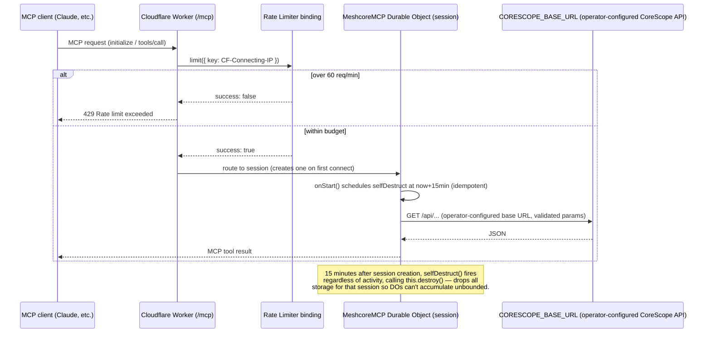

# Architecture

`meshcore-mcp` is a stateless-in-spirit MCP proxy running on a single
Cloudflare Worker. It has no database, no user accounts, and no secrets — it
translates MCP tool calls into `GET` or `POST` requests (three tools use
`POST` because they need a JSON body, not because they write anything — see
SECURITY.md) against a CoreScope MeshCore analyzer instance chosen by
whoever deploys it (`CORESCOPE_BASE_URL`), and hands the JSON straight
back.

## Request flow

## Why this shape

- **No auth.** Every CoreScope endpoint this server wraps is already an
  unauthenticated public `GET` route — there's no private data or write
  capability behind it, so there's nothing an API key would protect. See
  [SECURITY.md](../SECURITY.md) for the full reasoning.
- **One operator-configured upstream, never per-request.** `CORESCOPE_BASE_URL`
  is a deploy-time Worker var (`wrangler.jsonc`), resolved once per tool call
  from `env`. No MCP tool input — no argument, no header — ever reaches the
  `fetch()` host, so this can't be turned into an open SSRF proxy to
  arbitrary hosts regardless of which instance the operator points it at.
- **Durable Objects, bounded.** The `agents` framework backs each MCP
  session with a Durable Object. Without a ceiling, an authless service
  could accumulate DOs indefinitely as sessions pile up. `SESSION_TTL_SECONDS`
  in `src/index.ts` schedules a self-destruct at session creation, capping
  every session's lifetime regardless of how active it is.
- **Rate limiting protects the upstream, not us.** The Cloudflare Rate
  Limiting binding (`wrangler.jsonc`, 60 req/min/IP) exists primarily so a
  noisy or buggy MCP client can't hammer whatever CoreScope instance is
  configured — likely someone else's community infrastructure — through
  this proxy.

## Files

- `src/corescope.ts` — the upstream client: URL building, query param
  forwarding, pubkey validation, error mapping.
- `src/index.ts` — Worker entrypoint, rate-limit check, MCP tool
  registration, session TTL.
- `src/corescope.test.ts` — unit tests for the upstream client (mocked
  `fetch`), including the path-confusion and rate-limit-adjacent cases.
